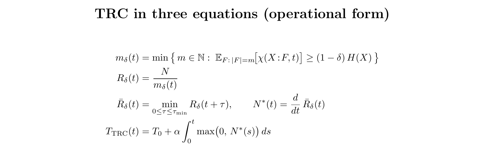

# Time as Record Closure  
## A Structural Principle for Temporality

**Author:** @thicctock  
**Date:** 2026-01-27  
**Status:** Conceptual proposal  

---

## Development process (transparency)

This began from a personal intuition—roughly: *time feels like the accumulation of “newness” (irreversible traces) locally, in what we call the present.*

It was developed through extended AI-assisted dialogue.

- **Human contribution (me):** the underlying intuition, scope, and conceptual claims.  
- **AI assistance (ChatGPT + Claude):** structuring, stress-testing objections, translating ideas into standard notation, and drafting toy-model / alignment material.

I’m presenting this as an exploratory synthesis and a compact framing—not a proof, and not a new dynamical theory. Technical critique is welcome.

---

## Summary

Time is not treated here as a primitive background parameter, but as a structural feature grounded in irreversible record formation. The proposal is that physically meaningful time corresponds to the monotone accumulation of stable records that render alternative histories dynamically inaccessible. This principle aims to unify entropy increase, causal asymmetry, memory, and explanation without privileging any specific spacetime geometry or interpretation of quantum mechanics.

---

## The Principle

### Principle of Temporal Record Closure

Time is constituted by the irreversible accumulation of stable records that render alternative histories physically inaccessible.

Formally:

T ≡ Aₚ(N*)

with the ordering condition:

Rₖ₊₁ ≽ Rₖ

and locality constraint:

N*(x) = 0 ∀ x ∉ P

### Definitions

- **T** — Physical temporal ordering (an order induced by record closure; not necessarily coordinate time)  
- **R** — Record / constraint state  
- **Aₚ** — Monotone accumulation operator restricted to a local record-forming domain **P**  
- **P** — Local record-forming interaction domain  
- **N\*** — Record-generating novelty (stable, redundantly encoded correlations; not mere reversible correlation)  
- **≽** — Partial order (“at least as constrained as”)  

A **record** is a stable, redundantly encoded physical correlation that persists under bounded local perturbations and restricts dynamically accessible future states.

---

## Technical notes (optional)

To make “record” and “closure” explicit:

- Let ρ map microstates ω to a macroscopic record state R:  ρ(ω)=R.  
- Define Γ(R) = { ω : ρ(ω)=R } as the set of microstates compatible with the same extant records.  
- **Semantic anchor:** R' ≽ R  ⇔  Γ(R') ⊆ Γ(R). (Later records exclude more alternatives.)

A “record” can be operationalized as a correlation about some variable X that is:
(i) **redundant** across many independent fragments of the environment, and  
(ii) **stable** over a persistence timescale τ under bounded local perturbations.

Let rδ(X) be the number of disjoint environment fragments each carrying ≥(1−δ) of the accessible information about X.  
Then **N\*** denotes record-generating novelty: events that increase stable redundancy (Δrδ>0 with τ≥τmin).

---

## TRC in three equations (operational form)

  
*Figure: TRC in three equations (operational form).*

---

## Scope and Non-Claims

This proposal does not:
- introduce a new dynamical law  
- privilege a quantum interpretation  
- assert time quantization  
- reduce time to entropy  
- depend on consciousness  

It is intended as a structural constraint on admissible theories of time.

---

## Motivation

Despite time-symmetric dynamical laws, entropy, causality, memory, and explanation all exhibit a shared asymmetry. This principle proposes record closure as the underlying structure unifying these arrows.

---

## Compatibility

The principle is compatible with:
- Relativity (no global present required)  
- Quantum mechanics (interpretation-agnostic)  
- Thermodynamics (grounds entropy direction)  
- Information-theoretic physics  

---

## Technical supplements (optional)

- [Alignment with standard physics structures](alignment.md)  
- [Appendix A: Toy models and diagram](appendix-a.md)  

---

## Remarks

This is a conceptual contribution intended to clarify the structural basis of temporality rather than replace existing physical theory.
